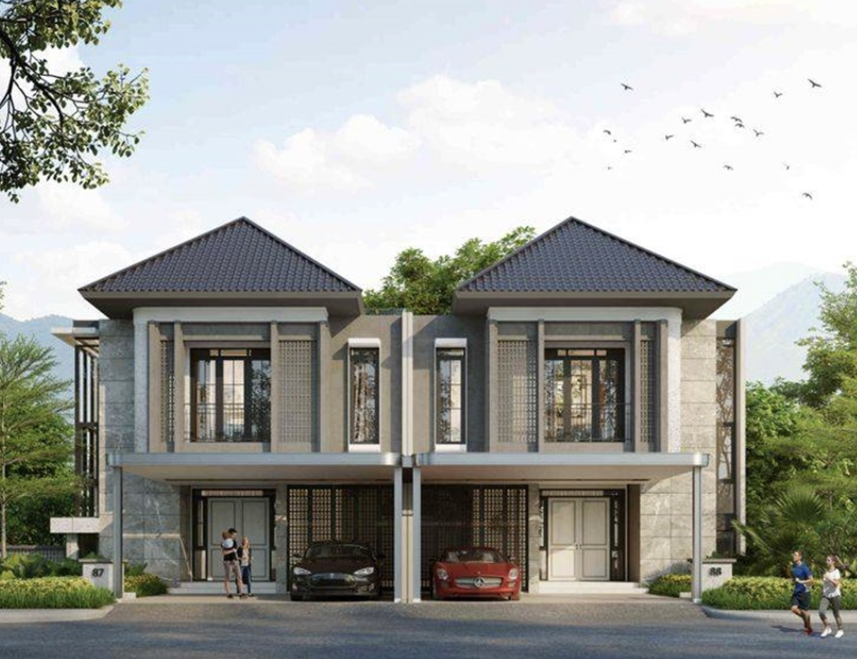

# MySkill Residence - Frontend Slicing Project

 

## Deskripsi Proyek
**MySkill Residence** adalah sebuah proyek portofolio *frontend* berupa *website* interaktif untuk pemasaran perumahan modern. Proyek ini awalnya merupakan tugas *slicing* UI dari desain MySkill, yang kemudian dikembangkan lebih lanjut dengan fungsionalitas interaktif penuh menggunakan **Vanilla JavaScript (tanpa *framework*)**. 

Proyek ini mendemonstrasikan penerapan *Client-Side Rendering* sederhana, *Dynamic Routing* berbasis parameter URL, serta manipulasi DOM untuk mengelola status tampilan halaman, menjadikannya fondasi yang sangat baik sebelum bermigrasi ke ekosistem komponen seperti React atau Vue.

## Fitur Unggulan

*   **Dynamic Data Rendering:** Daftar tipe rumah dan artikel blog tidak di-*hardcode* di HTML, melainkan dirender secara dinamis melalui JavaScript (*Mock Data / JSON*).
*   **Vanilla JS "Routing":** Menggunakan `URLSearchParams` untuk menangkap parameter `?tipe_rumah=` dan `?id=`. Halaman detail rumah dan detail blog akan menyesuaikan kontennya secara otomatis berdasarkan ID yang dipilih.
*   **Edge Case Handling (404 Fallback):** Dilengkapi dengan UI *Error State* khusus. Jika pengguna memasukkan URL atau ID yang tidak valid, sistem tidak akan *crash*, melainkan menampilkan pesan error interaktif.
*   **Real-time Search Filter:** Fitur pencarian artikel blog yang langsung merespons setiap input karakter (termasuk penanganan *Empty State* jika artikel tidak ditemukan).
*   **WhatsApp Gateway Integration:** Form "Hubungi Kami" pada halaman Kontak tidak hanya menjadi hiasan UI, tetapi langsung mengambil data *input* (*user*, *email*, *subject*, pesan) dan mengarahkannya ke draf pesan WhatsApp Web/App secara otomatis.
*   **Smart Active Navigation:** Indikator menu aktif akan mendeteksi path URL saat ini secara dinamis dan memberikan sorotan pada menu yang sesuai (mendukung URL *root* maupun *sub-path*).
*   **Responsive & Animated:** Tata letak disesuaikan untuk berbagai ukuran layar (*Mobile First* untuk navigasi) dan dianimasikan menggunakan *library* AOS dan GSAP untuk pengalaman visual yang *smooth*.

## Teknologi yang Digunakan
*   **HTML5** (Semantik struktur halaman)
*   **CSS3** (Variabel global `:root`, Flexbox, CSS Grid, Media Queries)
*   **Vanilla JavaScript** (ES6+, DOM Manipulation, Event Listeners)
*   **AOS (Animate On Scroll)** (Transisi saat *scroll*)
*   **GSAP** (Animasi *hero section* dan *header*)

## Struktur Proyek Terpenting
*   `index.html` - Halaman Beranda (Hero section, Fasilitas)
*   `tipe_rumah.html` & `detail_rumah.html` - Menampilkan katalog rumah dinamis.
*   `blog.html` & `detail_blog.html` - Menampilkan daftar artikel dengan fitur pencarian.
*   `kontak.html` - Form fungsional terintegrasi WhatsApp API.
*   `css/style.css` - Desain antarmuka, variabel warna utama.
*   `js/script.js` - Logika inti (Data, Rendering, Routing, Form Handling).
*   `content/` - Folder penyimpanan raw HTML untuk disuntikkan ke halaman blog.

## Cara Menjalankan Proyek Secara Lokal

Karena proyek ini bergantung pada parameter URL (`?id=`), sangat disarankan menjalankannya menggunakan *Local Web Server* agar protokolnya `http://` (bukan `file://`).

1. Lakukan *Clone* repositori ini:
   ```bash
   git clone https://github.com/firdhausranggaa/myskill-residence.git
   ```
2. Buka folder proyek di Visual Studio Code.
3. Gunakan ekstensi **Live Server** (klik kanan pada `index.html` -> *Open with Live Server*).
4. Proyek akan berjalan di `http://127.0.0.1:5500/`.

## 👨‍💻 Pengembang
**Rangga Razzaq Firdhaus**
*   Dikembangkan sebagai bagian dari persiapan Portofolio *Frontend Engineering*.

*Desain UI asli berdasarkan materi bootcamp MySkill. Semua pengembangan logika JavaScript dan pengkodean HTML/CSS dilakukan secara independen.*
